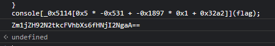
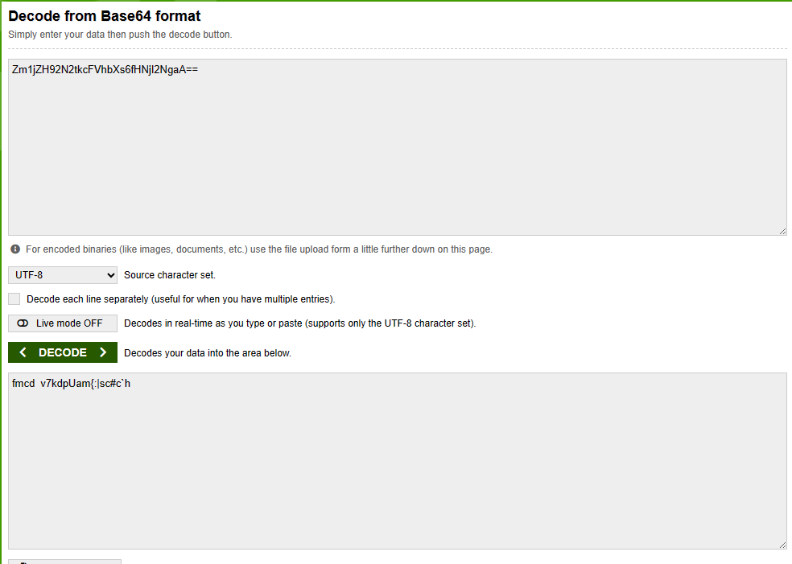
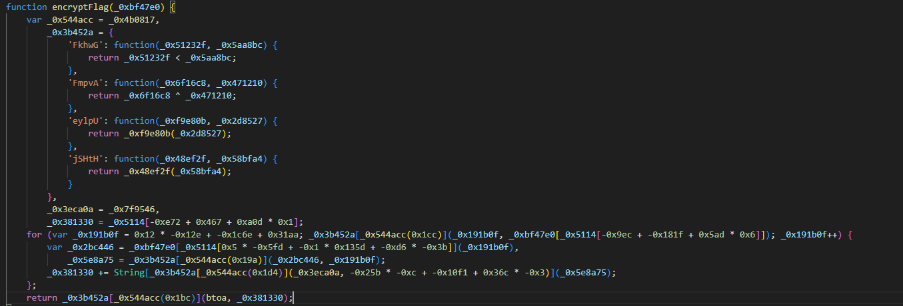
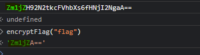
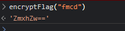
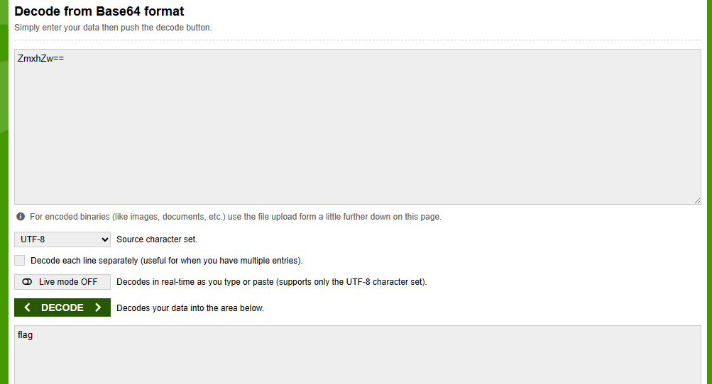
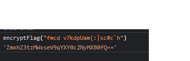
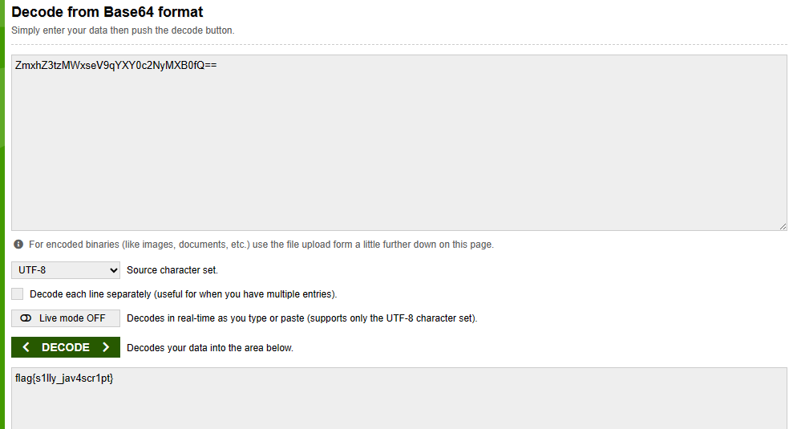

# Tenable Capture the Flag 2023

## PseudoRandom

Tags: _rev_

## Solution

Some obfuscated [`javascript code`](code.js) was given:
```javascript
var _0x4b0817=_0x3cdb;(function(_0x25abc1,_0x1b11ab){var _0x21dd4f=_0x3cdb,_0x15cf55=_0x25abc1();while(!![]){try{var _0x187219=par...
```

so, before I went in code deep, I just paste it in console and that what I get.



I decoded it from base64.



I have found this encrypt function in code, I just run it with “flag”





and it seems it's the first part of our cipher text I just decoded it and try to put it the same function to see what I will get.





its flag so the function encrypt can decrypt it to if we put decoded cipher in it.





Flag `flag{s1lly_jav4scr1pt}`