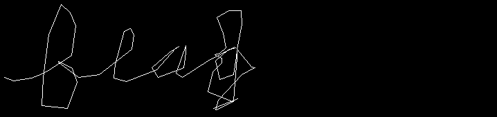
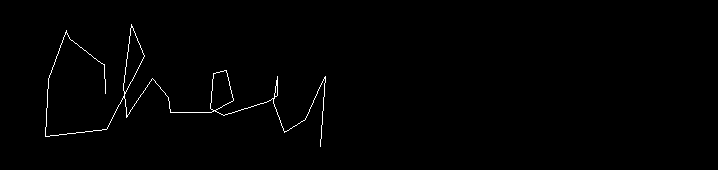
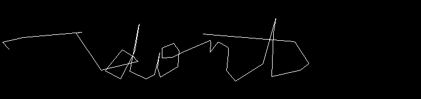
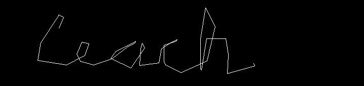
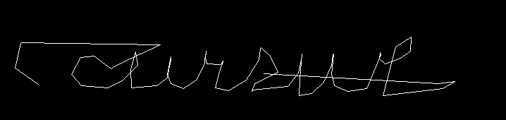
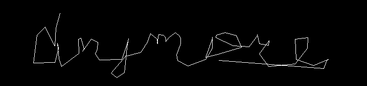
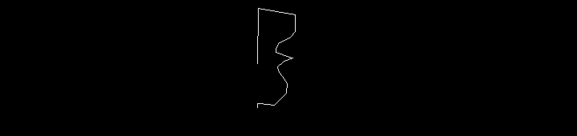

# Tenable Capture the Flag 2023

## Ancient Scrawls

> My friends and I kept getting caught passing notes in computer class, so we came up with a different way to communicate.
>
>  Author: N/A
>
> [`ancient_scrawls.gif`](ancient_scrawls.gif)

Tags: _stego_

## Solution
For this challenge a `Gif` is given. After opening we can see a mouse cursor move over the image. Looking closely one can see that the cursor is writing letters, so the flag might be reconstructible if the mouse position is traced.

Doing this by hand (or video editing tool) is tedious so we write a quick script to extract the words. Some things where to consider: Words where overlapping, so just tracking the mouse cursor and drawing lines between points will result in a mess of lines. Therefore I tried to detect word boundaries by checking cursor move distance and direction. 

The mouse position can easily be detected, since the background is white we just search the first non-white pixel to get the position.

```python
import cv2

# Load the GIF as a list of frames
gif_path = r'ancient_scrawls.gif'

gif = cv2.VideoCapture(gif_path)

# Initialize variables for previous cursor position and line buffer
line_buffer = []

# Initialize frame counter
frame_number = 0

# Loop through each frame in the GIF
while True:
    ret, frame = gif.read()
    if not ret:
        gif.set(cv2.CAP_PROP_POS_FRAMES, 0)  # Reset to the beginning of the GIF
        line_buffer = []  # Clear the line buffer
        continue

    # Convert the frame to grayscale
    gray_frame = cv2.cvtColor(frame, cv2.COLOR_BGR2GRAY)

    # Calculate the absolute difference between the current and previous frames
    if frame_number == 0:
        prev_frame = gray_frame
    diff_frame = cv2.absdiff(prev_frame, gray_frame)

    # Apply Gaussian blur to reduce noise
    blurred = cv2.GaussianBlur(diff_frame, (5, 5), 0)

    # Apply thresholding to detect black regions
    _, thresholded = cv2.threshold(blurred, 30, 255, cv2.THRESH_BINARY)

    # Find contours in the thresholded image
    contours, _ = cv2.findContours(thresholded, cv2.RETR_EXTERNAL, cv2.CHAIN_APPROX_SIMPLE)

    # Find the largest contour to track using Mean-Shift
    max_area = 0
    max_contour = None
    for contour in contours:
        area = cv2.contourArea(contour)
        if area > max_area:
            max_area = area
            max_contour = contour

    # If a valid contour is found, update the line_buffer
    if max_contour is not None:
        moments = cv2.moments(max_contour)
        if moments['m00'] != 0:
            centroid_x = int(moments['m10'] / moments['m00'])
            centroid_y = int(moments['m01'] / moments['m00'])
            line_buffer.append((centroid_x, centroid_y))

    # Draw a polyline connecting points directly on the frame
    for i in range(1, len(line_buffer)):
        cv2.line(frame, line_buffer[i - 1], line_buffer[i], (0, 0, 255), 2)

    # Display the result with frame number
    cv2.putText(frame, f"Frame: {frame_number}", (10, 30), cv2.FONT_HERSHEY_SIMPLEX, 1, (0, 255, 0), 2)
    cv2.imshow('Handwriting Simulation', frame)

    # Slow down the display speed (adjust the value to control the speed)
    delay = 100  # milliseconds
    if cv2.waitKey(delay) & 0xFF == ord('q'):
        break

    # Update the previous frame and frame number
    prev_frame = gray_frame
    frame_number += 1

# Release the GIF and close windows
gif.release()
cv2.destroyAllWindows()
```

This will generate a sequence of files with some words in it.

      

It was a hard time to decipher this "handwriting", but in the end the sequence of `flag{`, `they`, `dont`, `teach`, `cursive`, `anymore`, `}` formed the flag 

Flag `flag{they_dont_teach_cursive_anymore}`