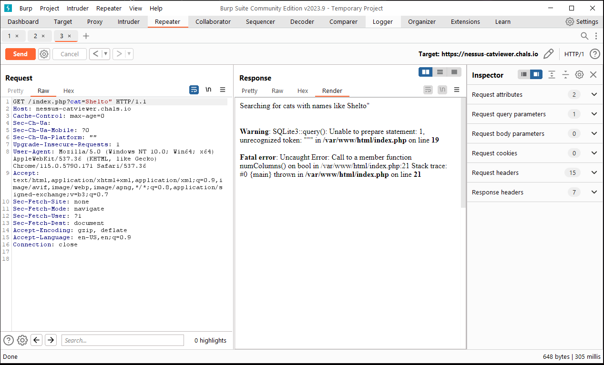
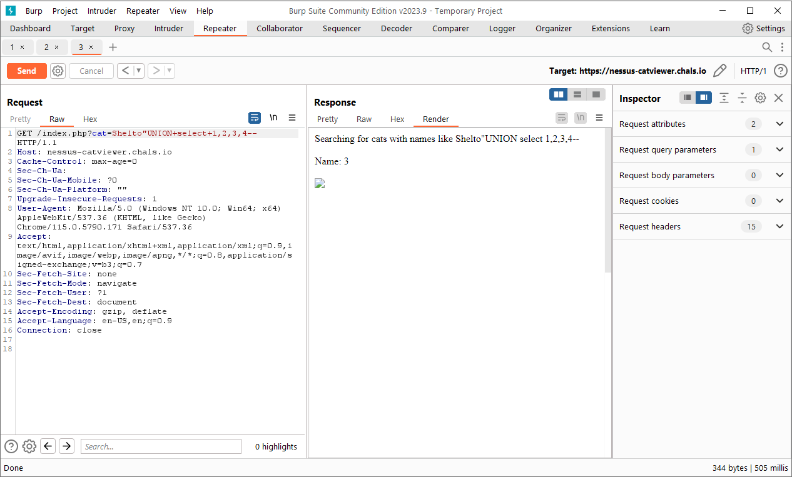
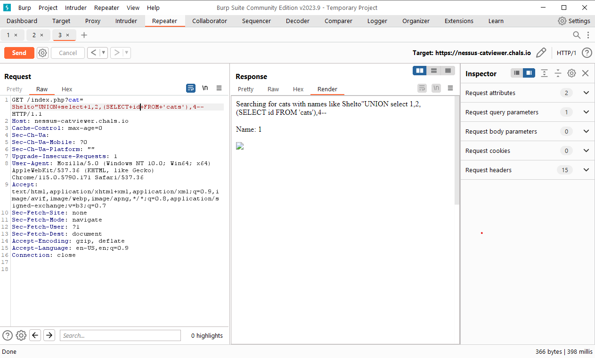
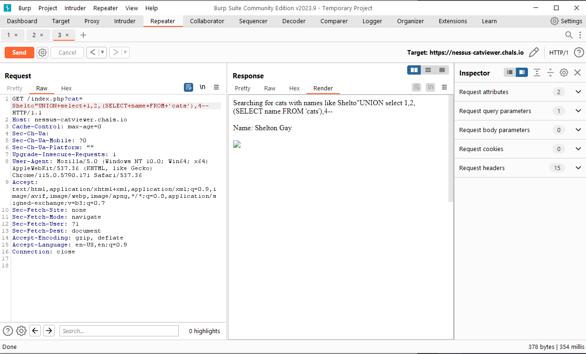
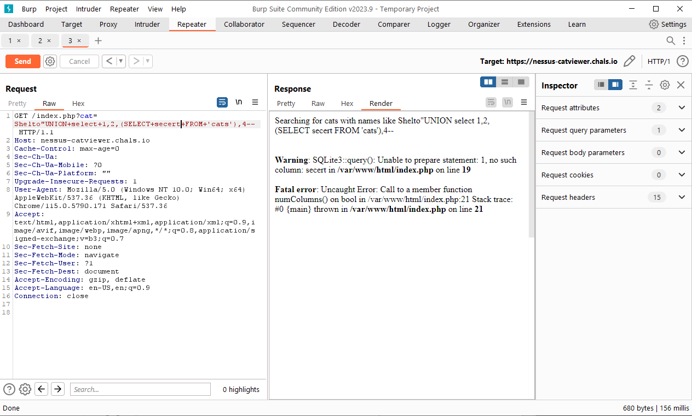
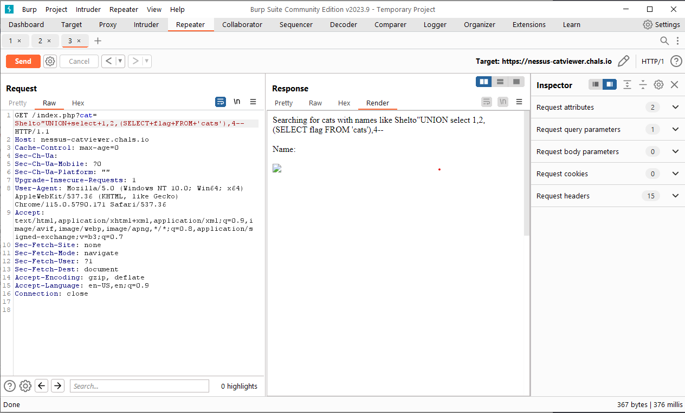
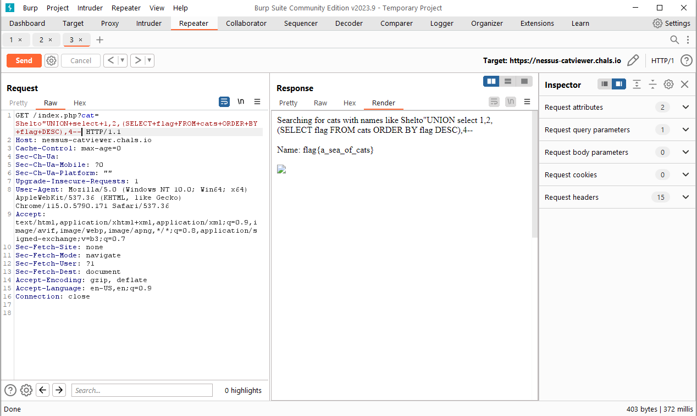

# Tenable Capture the Flag 2023

## Cat Viewer

> I built a little web site to search through my archive of cat photos. I hid a little something extra in the database too. See if you can find it!
>
>  Author: N/A
>

Tags: _web_

## Solution
The webapp given for this challenge allows to query cats. The query name is known as the link from the challenge description automatically shows a cat named `Shelton` (https://nessus-catviewer.chals.io/index.php?cat=Shelton).

After some trial and error I got an interesting error when entering `"`:

So, this is a `sqli` vulnerability we are looking for. Also we know we have a `SQLite` database running at the other end. With this information we can start some recon, first we check if a `union select` works and what parameter is displayed:

Knowing we can inject into parameter 3 we can try to find the name of the columns that is queried.

so we sort the table by column content of flag adn we get it

Flag `flag{a_sea_of_cats}`